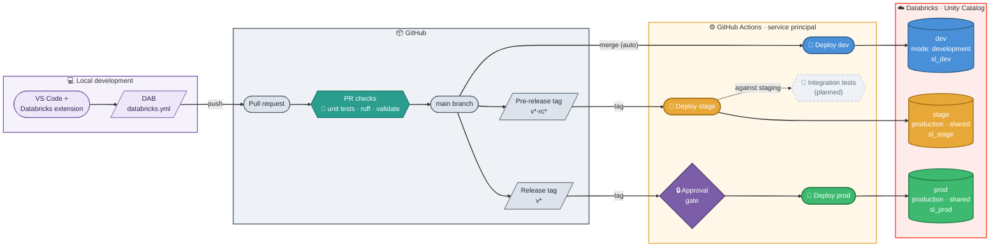
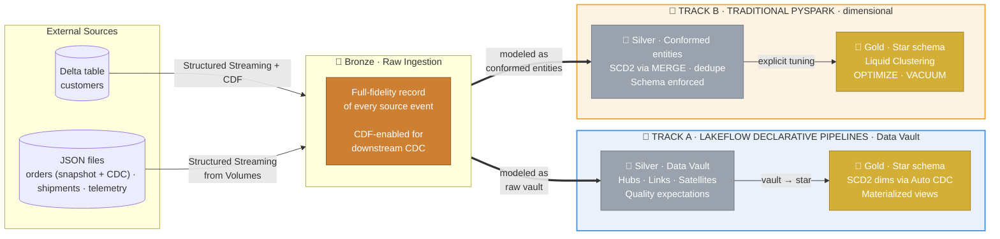
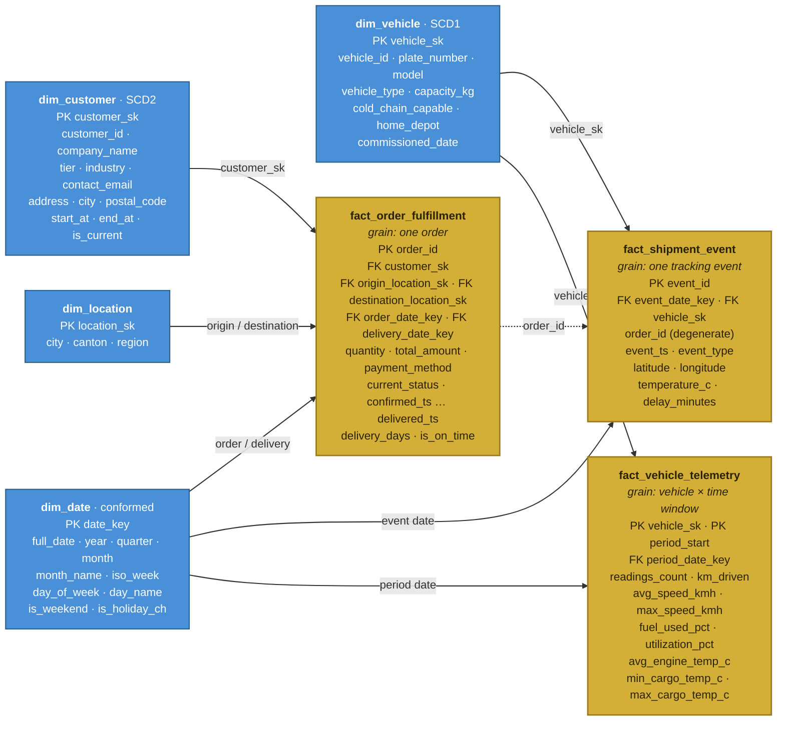
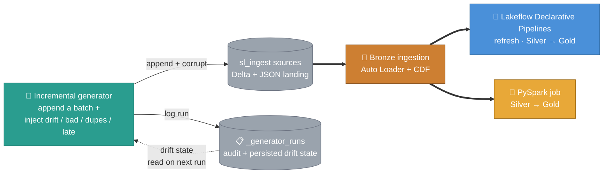
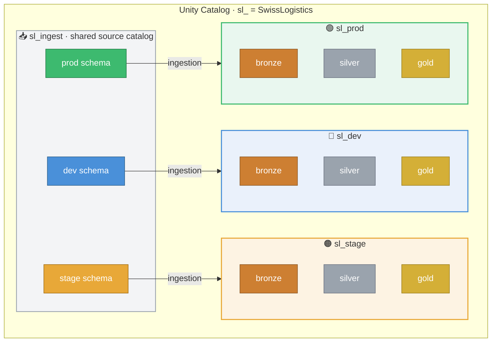

# Databricks Data Engineering Platform

> A production-grade data engineering project built on Databricks: fully automated, version-controlled, and running on the free tier.

_Started as Databricks DE Professional exam practice, now grown into a production-style platform build._

This project covers the **data engineering layer** end-to-end, from ingestion through transformation (covering both **Spark Structured Streaming** and **batch** patterns) to automated deployment: ingestion from multiple source types (**JSON**, **delta lake**), medallion architecture built both ways with **Lakeflow Declarative Pipelines** and traditional **PySpark**, each track with its own modeling approach (**Data Vault** in Silver on the declarative track, conformed dimensional entities on the PySpark track, both converging on a **Kimball star schema** in the **Gold data mart**), plus **Change Data Capture**, **data quality**, **performance optimisation**, **environment separation**, and a fully wired **CI/CD pipeline** that deploys automatically to Databricks with **Declarative Automation Bundles (DABs)** on every Git event, with no manual steps required. A built-in **incremental data generator** advances the sources before every run, simulating **messy data** (duplicates, bad records, late arrivals) and **schema drift**. Platform concerns like governance and infrastructure-as-code are intentionally out of scope (see below).

It maps directly to the **Databricks Certified Data Engineer Professional** exam curriculum and reflects how modern data engineering teams work in practice.

> 🚧 **Work in progress.** The platform foundation (repo structure, environment separation, CI/CD, and Bronze ingestion, Silver Pyspark) is in place. The data modeling blueprint, transformation layers, performance optimization, and quality management are next. See [**Project status**](#project-status-40) below for the full breakdown.

## The data: SwissLogistics AG

The platform runs on a fictional dataset generated by the setup notebook: **SwissLogistics AG**, a Zurich-based logistics company running 200+ delivery vehicles across Switzerland and handling ~50K shipments a month for B2B and B2C customers. Five sources feed the pipeline. Each one stands in for a different real-world system and delivery pattern, and each carries a deliberate wrinkle that exercises a specific engineering technique:

| Dataset | Mimics (real-world source) | Delivery & format | Nature & traits |
|---|---|---|---|
| **`customers`** | Operational OLTP database: a Postgres customer master (current-state, no history) | Delta table with **Change Data Feed** | ~200 customers. CDF emits insert / update / delete **post-images**; feeds the **SCD Type 2** dimension via Auto CDC. Source **deletes propagate downstream** (GDPR / Swiss FADP right-to-erasure). |
| **`orders`** | **File-based CDC export** (vendor extract, or a Debezium / Fivetran-style feed to object storage) | JSON files on a UC Volume, **Auto Loader** | 50K orders. Initial **snapshot**, then incremental INSERTs / UPDATEs as **full-row post-images**; ~2% **missing amounts**. Versioned for **SCD Type 2** (order-status history); no deletes. |
| **`shipment_events`** | High-volume **event stream** (Kafka / IoT Hub) micro-batched to storage | JSON files on a UC Volume, **Auto Loader** | ~515K tracking events (GPS, status, cold-chain and delay alerts). Append-only; ~3% **duplicate** event IDs. |
| **`vehicle_telemetry`** | **IoT / telematics** fleet under at-least-once delivery | JSON files on a UC Volume, **Auto Loader** | ~200K sensor readings, ~every 30s per vehicle. Dedup key is `reading_id` (timestamps are not unique); volume deliberately **skewed**: 60% of rows from 5 vehicles. |
| **`vehicles`** | Slow-moving **master data**: the fleet register | JSON files on a UC Volume, **Auto Loader**; seed plus rare drops | 200 vehicles. Rare depot reassignments as full-row post-images: a plain **SCD Type 1** source. No backfill, no history, no deletes. |

**SCD Type 2, two ways.** `customers` and `orders` both land as Type 2 history, but through different mechanisms: a native Delta Change Data Feed vs a file-based CDC export read with Auto Loader. Both deliver full-row post-images into the same SCD2 apply, and that contrast is the point.

## How it all fits together

The Git ↔ Databricks integration follows **Databricks' recommended per-environment pattern**:

- **Dev runs in development mode, and deploys are automated.** The `dev` target uses `mode: development`, so every deploy is an isolated copy with resources prefixed `[dev <user>]` and schedules paused. CI/CD auto-deploys `dev` on every merge to `main` (via the service principal), and developers can also deploy their own copy locally with `databricks bundle deploy -t dev`. Either way it lands under the deploying user's workspace, so nobody collides and no manual step is needed.
- **Stage and prod run in production mode on shared paths.** They are deployed only by CI/CD via a service principal (PAT-based on Free Edition) to fixed shared paths (`/Workspace/Shared/<target>/…`), never from a personal account, and only on tags. Promotion is gated: a pre-release tag (`v*-rc*`) deploys to stage (integration tests planned); a release tag (`v*`) deploys to prod behind a GitHub Environment approval gate.

Nothing reaches production without passing the PR checks and the prod approval gate. Automated unit and integration tests are in progress/planned (see the status table below).

---

## Data pipeline: Bronze → Silver → Gold

Data moves through three isolated layers, each with a clear responsibility. The transformation work from Silver to Gold is implemented **twice**, once with Declarative Pipelines and once with classic PySpark, covering both paradigms in depth. The two tracks also demonstrate **two data modeling approaches**: the declarative track builds a **Data Vault** style Silver (insert-only hubs, links, and satellites loaded via streaming tables), while the PySpark track builds **conformed, SCD2-historized entity tables** with explicit MERGE logic. Both converge on the same **Kimball star schema** design in Gold; the declarative track derives its SCD2 dimensions from the vault satellites via Auto CDC, so each track exercises a different historization technique end to end.

### Gold layer: the star schema data mart (draft)

Both tracks converge on the same **Kimball dimensional model**. It is more of a **fact constellation** (multiple fact tables sharing conformed dimensions), not a single star: `dim_date` is conformed across all three facts and `dim_vehicle` is shared by shipment events and telemetry. `dim_customer` is historized as **SCD Type 2** (`start_at` / `end_at` / `is_current`), `dim_vehicle` as **SCD Type 1**, and `order_id` travels on `fact_shipment_event` as a **degenerate dimension** linking events back to the order grain.

Grain, one line per fact: `fact_order_fulfillment` = one order; `fact_shipment_event` = one tracking event; `fact_vehicle_telemetry` = one vehicle per time window. Gold facts are shown in **gold**, dimensions in **blue**.

> Interactive version (with full column types): [SwissLogistics Gold Star Schema on dbdiagram.io](https://dbdiagram.io/d/SwissLogistics-Gold-Star-Schema-6a4aab974ac62e474c32f352).

---

## Keeping the data messy: the incremental generator

The initial seed is static, but real pipelines face a moving target. A second notebook, `incremental_data_generator.ipynb`, runs **before each pipeline execution** and advances the dataset: it appends a new batch to the `sl_ingest` sources and can inject realistic mess. Two controls keep this deliberate. **Probabilistic anomalies** (bad records, duplicates, late data) are toggled per dataset and hit a small random share of rows. **Schema drift** is an explicit per-table choice (`DRIFT_THIS_RUN` via job parameters) that adds one new column at a time, deterministically. Every run is logged to a `_generator_runs` tracking table that doubles as **persistent state**: once a column drifts in, the table records it so the next run keeps emitting it, exactly like a real upstream change.

Wired as a shared seed step, it runs once and both tracks consume the fresh batch:

So every declarative pipeline and PySpark run is exercised against genuinely changing, imperfect input: schema evolution, quality quarantine, dedup and CDC upserts get tested continuously rather than against a one-time fixture.

---

## Environment separation

Environments are separated **at the catalog level**, within a single workspace (Free Edition provides only one). Each environment gets its own catalog, prefixed **`sl_`** (for **S**wiss**L**ogistics): `sl_dev`, `sl_stage`, and `sl_prod`, plus a shared `sl_ingest` source catalog. In a paid setup I'd push this to separate workspaces per environment (with catalog binding as needed), but that's beyond Free Edition.

The active environment is controlled by a single `env` variable in the bundle. Catalog names, checkpoint paths, and source schemas all derive from it, with no hardcoded environment strings anywhere in the code.

---

## Project status: 40%

`██████████░░░░░░░░░░░░░░░` **40% complete**

| Component | Status |
|---|---|
| Repo structure & Declarative Automation Bundles | ✅ Done |
| Git integration & CI/CD (PR checks → dev → stage → prod) | ✅ Done |
| Environment separation (catalogs + bundle targets) | ✅ Done |
| Source data generation (setup notebook) | ✅ Done |
| 🥉 Bronze ingestion (Auto Loader + CDF) | ✅ Done |
| 🔄 Incremental data generator | ✅ Done |
| 🗺️ Data modeling blueprint (bus matrix → star + vault design) | 🚧 In progress |
| 🥈 Silver · Classic PySpark (conformed entities, SCD2) | ✅ Done |
| 🥇 Gold · Classic PySpark (star schema) | 🚧 In progress |
| ✔️ Validation · Classic PySpark path | 🚧 In progress |
| 🥈 Silver · Lakeflow Declarative Pipelines (Data Vault) | ⬜ Planned |
| 🥇 Gold · Lakeflow Declarative Pipelines (star schema) | ⬜ Planned |
| ✔️ Validation · Lakeflow Declarative Pipelines path | ⬜ Planned |
| Performance Optimization | ⬜ Planned |
| Data quality / expectations | ⬜ Planned |
| 🧪 Unit tests (pytest) | 🚧 In progress |
| Integration tests | ⬜ Planned |
| Dashboards | ⬜ Planned |
| 🏁 Final validation (end-to-end) | ⬜ Planned |

---

## What this covers

| Area | Detail |
|---|---|
| **Ingestion** | Structured Streaming from Delta (CDF) and JSON files in UC Volumes |
| **Change Data Capture** | Full-load bootstrap + incremental CDC; CDF enabled on Bronze targets |
| **Continuous simulation** | Generator appends messy batches before each run; drift/bad/dupes tracked in an audit table with persistent schema-drift state |
| **Lakeflow Declarative Pipelines** | Python `pyspark.pipelines` (`@dp.table`). Quality expectations, Auto CDC, dependency graph |
| **Traditional PySpark** | Notebook-based Silver/Gold; explicit `OPTIMIZE`, Liquid Clustering, `VACUUM` |
| **Data quality** | Declarative pipeline expectations + manual validation; schema enforcement across both tracks |
| **Data modeling** | Data Vault Silver (declarative track) vs conformed SCD2 entities (PySpark track), both feeding a Kimball star schema Gold |
| **Declarative Automation Bundles (DABs)** | All infrastructure declared in `databricks.yml`: jobs, pipelines, permissions |
| **CI/CD** | GitHub Actions: automated test, deploy, and gated release pipeline |
| **Unity Catalog** | All data in UC tables and Volumes; no DBFS, no mounts |
| **Environment separation** | Catalog-level separation (dev / stage / prod) in a single Free Edition workspace |
| **Serverless compute** | No cluster configuration; runs on Databricks serverless throughout |
| **Testing** | pytest + Databricks Connect for unit tests; integration tests against staging |

---

## What's intentionally out of scope

Real production concerns, deliberately not part of this repo. Pipeline logic and platform infrastructure are owned by different teams in mature organisations, and the first four rows would live in a companion **infrastructure repo** (Terraform + Databricks provider), a natural next step.

| Area | Notes |
|---|---|
| **DDL / tables as IaC** | Catalogs, schemas, and tables are bootstrapped via a setup notebook, not managed declaratively. |
| **Access control & permissions** | No UC groups, grants, row/column security, masking, or ABAC tags. |
| **Service principals** | CI/CD uses a PAT for simplicity; SP lifecycle and secret rotation belong in the infra layer. |
| **UC governance as code** | Ownership, tags, lineage policies, audit log routing. |
| **Lakehouse Federation** | All data is ingested; no zero-copy querying via UC foreign catalogs. |
| **Lakebase** | Analytical OLAP only; no managed Postgres for operational serving / reverse-ETL. |
| **Delta Sharing & Clean Rooms** | No cross-organisation sharing or clean-room collaboration. |
| **Lakehouse Monitoring** | Quality is enforced inline via expectations; no managed profiling/drift monitoring. |
| **Serving & BI** | Gold tables are not surfaced through SQL warehouses, AI/BI Dashboards, or Genie. |
| **ML & GenAI** | No MLflow, Model Serving, Vector Search, or AI functions. |
| **Managed ingestion (Lakeflow Connect)** | Sources are simulated; no managed SaaS connectors. |

Several of these are also limited or unavailable on Free Edition, so the scope reflects both a deliberate DE focus and the platform's free-tier limits.

---

## Key design decisions

**Dual-track Silver/Gold, two modeling approaches.** Building Silver and Gold twice is intentional, and the two tracks deliberately model the data differently. The declarative track loads a Data Vault style Silver (insert-only hubs, links, and satellites, a natural fit for streaming tables) and derives its star schema dimensions from the satellites with Auto CDC. The PySpark track builds conformed SCD2 entity tables with hand-written MERGE logic and an explicitly optimised star schema Gold. The declarative pipeline manages the dependency graph, retries, and CDC automatically; PySpark gives full control over optimisation and is what most teams still run for complex legacy pipelines.

**No DBFS, no mounts.** All storage is Unity Catalog tables and Volumes. Fine-grained access control, full lineage, no legacy path hacks.

**Free Edition only.** The entire project runs within the Databricks Free Edition (2025 serverless + Unity Catalog tier). Where the free tier imposes real constraints, the project documents the limitation and uses the correct workaround (eg. PAT-based auth in GitHub Actions secrets).

---

## Tech stack

| | |
|---|---|
| **Platform** | Databricks Free Edition (serverless + Unity Catalog) |
| **Infrastructure as code** | Declarative Automation Bundles (DABs) |
| **Pipelines** | Lakeflow Declarative Pipelines (Python `@dp.table`) + traditional PySpark |
| **Ingestion** | PySpark Structured Streaming |
| **Storage** | Delta Lake on Unity Catalog |
| **CI/CD** | GitHub Actions |
| **Testing** | pytest + Databricks Connect |
| **Package management** | uv |
