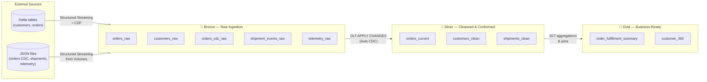
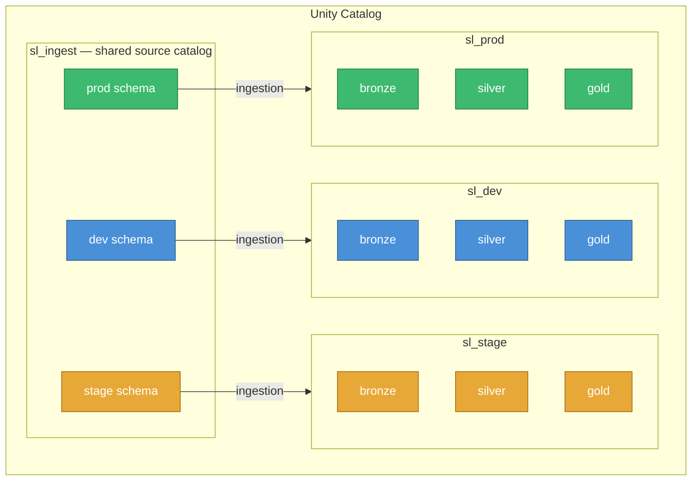
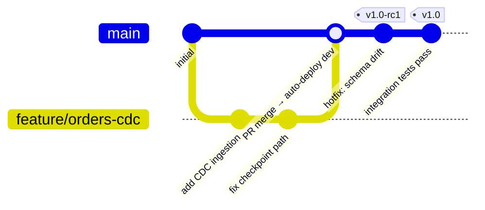

# Databricks DE Professional Practice

A hands-on reference project demonstrating production-grade data engineering practices on the Databricks Data Intelligence Platform. It covers the patterns, tooling, and conventions tested in the **Databricks Certified Data Engineer Professional** exam — implemented end-to-end, not just as code snippets.

The Silver → Gold transformation and optimization work is intentionally built **twice**: once using **Delta Live Tables** (declarative pipelines) and once using **traditional PySpark** (notebook-based). This covers both paradigms tested in the certification and reflects how real-world teams often run a mix of both — DLT for production pipelines and PySpark notebooks for ad-hoc transformation work, migration projects, or scenarios where DLT is not available.

Both tracks apply the same practices: data quality expectations, schema enforcement, partitioning and Z-ordering for query performance, and incremental processing via CDC.

---

## What this project demonstrates

| Area | What's covered |
|---|---|
| **Ingestion** | Structured Streaming from Delta tables (CDF) and JSON files |
| **Medallion architecture** | Bronze → Silver → Gold with clear layer responsibilities |
| **Change Data Capture** | Full-load + incremental CDC pattern; CDF-enabled Bronze for downstream consumption |
| **DLT pipelines** | Python-only Delta Live Tables (`@dlt.table`) — declarative Silver/Gold track |
| **Traditional PySpark** | Notebook-based Silver/Gold track: same logic, manual orchestration, explicit optimisation |
| **Data quality** | DLT expectations + manual PySpark validation; schema enforcement across both tracks |
| **Performance optimisation** | Partitioning, Z-ordering, `OPTIMIZE`, `VACUUM` applied in the PySpark track |
| **Asset bundles (DABs)** | Declarative infrastructure-as-code via `databricks.yml` |
| **Environment separation** | Three isolated targets (dev / stage / prod) with separate Unity Catalog schemas |
| **CI/CD** | Trunk-based Git flow with automated deploy and gated production releases |
| **Unity Catalog** | All data in UC tables and Volumes — no legacy DBFS or mounts |
| **Serverless compute** | Runs entirely on Databricks serverless — no cluster configuration required |
| **Testing** | Unit tests via pytest + Databricks Connect; integration tests against staging |

---

## Repository layout

```
databricks_de_professional_practice/
│
├── databricks.yml              # Bundle definition: targets, variables, permissions
├── pyproject.toml              # Python project metadata and dependencies (uv)
│
├── resources/                  # Databricks resource definitions (jobs, pipelines)
│   ├── setup_job.yml           # One-time environment bootstrap job
│   ├── bronze_ingestion.yml    # Streaming ingestion job (Delta + JSON sources)
│   └── *.pipeline.yml          # DLT pipeline definition (Silver/Gold)
│
├── src/
│   ├── setup/
│   │   └── environment_setup.ipynb     # Creates catalogs, schemas, volumes
│   ├── ingestion/
│   │   ├── from_delta/                 # CDF streaming from Delta source tables
│   │   │   ├── customers.ipynb
│   │   │   └── orders.ipynb
│   │   └── from_json/                  # Streaming from JSON files in Volumes
│   │       ├── orders_cdc.ipynb
│   │       ├── shipment_events.ipynb
│   │       └── telemetry.ipynb
│   └── dlt_dbx_prof_practice/
│       └── transformations/            # DLT Python @dlt.table definitions (Silver/Gold)
│
├── tests/
│   ├── conftest.py             # Databricks Connect spark fixture
│   └── *.py                    # Unit tests (pytest)
│
└── fixtures/                   # Static data fixtures for testing
```

---

## Architecture: Medallion layers

Data flows through three layers, each with a clear and distinct responsibility.



**Bronze** is a faithful, append-only record of everything that arrived from the source — including CDC change events. Change Data Feed is enabled on Bronze tables so downstream Silver pipelines can consume them efficiently.

**Silver** applies CDC merge logic (`APPLY CHANGES INTO`) to reconstruct the current state of each entity. Data is cleansed, typed, and conformed to a consistent schema.

**Gold** joins and aggregates Silver tables into business-facing datasets — one row per meaningful business concept, ready for analysts and BI tools.

---

## Environment separation & catalog structure

Each environment gets its own isolated Unity Catalog. There is no shared mutable state between environments — a bug in dev can never touch prod data.



The target environment is passed as a bundle variable (`env: dev|stage|prod`), which drives both the catalog name and the source schema — no hardcoded environment strings anywhere in the notebooks or pipeline code.

---

## Git & deployment flow (trunk-based)

A single long-lived branch (`main`) is the source of truth. Developers work on short-lived feature branches and merge via pull request. Environment promotion happens through Git tags — not branch merges.



| Event | What happens automatically |
|---|---|
| **Pull request opened** | Unit tests (pytest) + `databricks bundle validate` |
| **Merge to `main`** | Auto-deploy to **dev** environment |
| **Pre-release tag** (`v*-rc*`) or manual dispatch | Deploy to **stage** + run integration tests |
| **Release tag** (`v*`) | Gated deploy to **prod** via GitHub Environment approval |

This means no code reaches production without passing through dev and stage first, and the final prod deploy always requires a human approval gate.

---

## Environment bootstrapping

Before running any pipelines, the environment must be initialised. The `setup_job` creates the required Unity Catalog objects (catalog, schemas, volumes) for the target environment. It is idempotent — safe to run multiple times.

```
databricks bundle run setup_job --target dev
```

---

## Running locally

This project uses [uv](https://docs.astral.sh/uv/) for dependency management and Databricks Connect for local Spark access.

```bash
# Install dependencies
uv sync --dev

# Run unit tests
uv run pytest

# Deploy to dev
databricks bundle deploy --target dev

# Run the ingestion job in dev
databricks bundle run bronze_ingestion --target dev
```

---

## Key design decisions

**Python DLT only.** All Delta Live Tables logic uses the Python `@dlt.table` decorator. SQL DLT is avoided so that pipeline logic stays version-controlled, testable, and consistent with the rest of the codebase.

**Notebooks for ingestion, DLT for transformation.** Structured Streaming ingestion (Bronze) runs as notebook tasks inside a job — this keeps raw ingestion simple and independently schedulable. DLT handles the transformation logic (Silver/Gold) where its dependency graph, quality expectations, and Auto CDC features add the most value.

**No DBFS, no mounts.** All data lives in Unity Catalog tables or UC Volumes (`/Volumes/<catalog>/<schema>/<volume>/`). This enforces fine-grained access control and makes the data lineage fully visible in the Databricks catalog.

**Serverless compute only.** No clusters to configure, size, or maintain. Compute scales automatically with the workload.

**Parameterised environments.** The `env` variable is the only thing that changes between dev, stage, and prod — catalog names, checkpoint paths, and source schemas all derive from it. This eliminates environment-specific code paths.

---

## Tech stack

- **Platform:** Databricks (Free Edition — serverless + Unity Catalog)
- **Orchestration:** Databricks Asset Bundles (DABs)
- **Pipelines:** Delta Live Tables (Python)
- **Ingestion:** PySpark Structured Streaming
- **Storage:** Delta Lake on Unity Catalog
- **CI/CD:** GitHub Actions
- **Testing:** pytest + Databricks Connect
- **Package management:** uv
