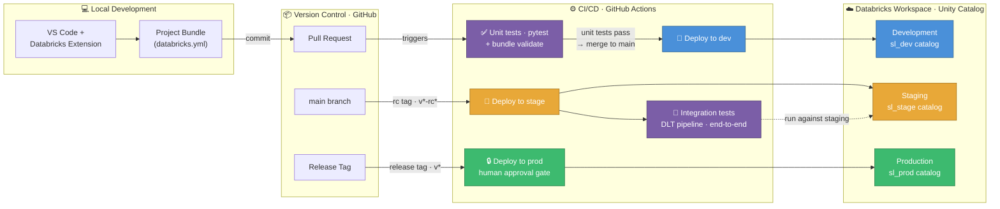
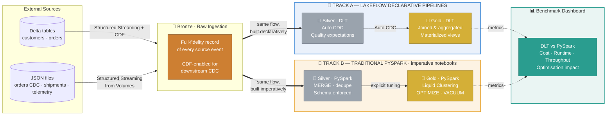
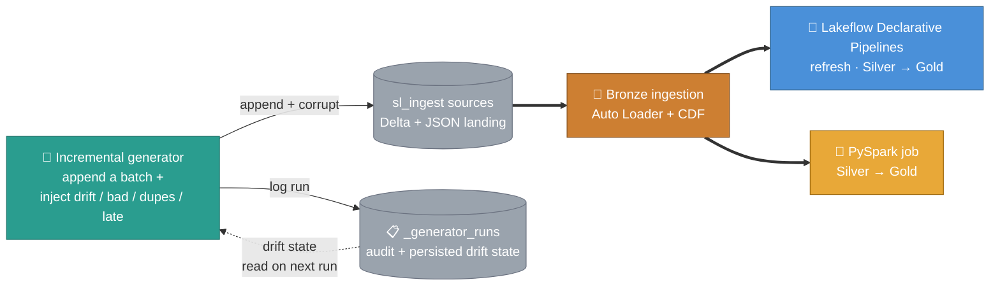
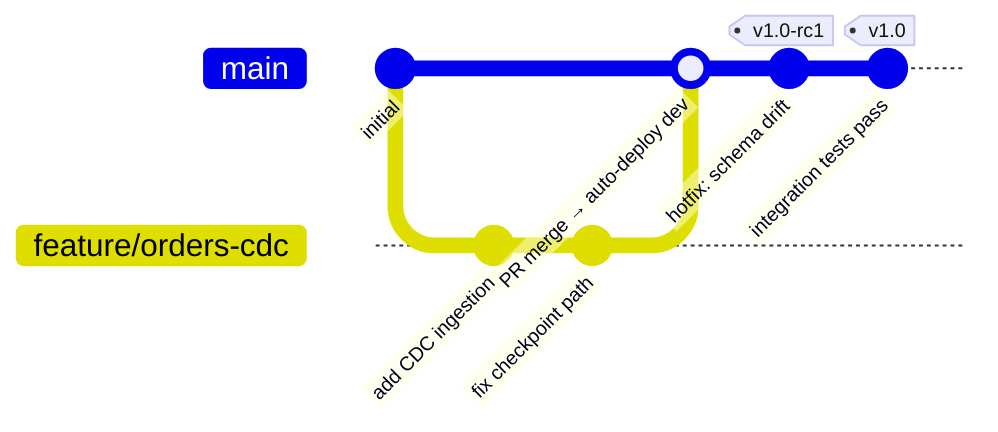

# Databricks DE Professional Practice

> A production-grade data engineering project built on Databricks — fully automated, fully tested, running on the free tier.

This project covers the complete data engineering lifecycle end-to-end: ingestion from multiple source types, medallion architecture built both ways — with **Lakeflow Declarative Pipelines** (formerly Delta Live Tables, "DLT") and **traditional PySpark** — Change Data Capture, data quality, performance optimisation, environment separation, and a fully wired CI/CD pipeline that deploys automatically to Databricks on every Git event — no manual steps required.

It maps directly to the **Databricks Certified Data Engineer Professional** exam curriculum and reflects how modern data engineering teams work in practice.

---

## The data: SwissLogistics AG

The platform runs on a fictional dataset generated by the setup notebook — **SwissLogistics AG**, a Zurich-based logistics company running 200+ delivery vehicles across Switzerland and handling ~50K shipments a month for B2B and B2C customers. Five source datasets feed the pipeline, each seeded with a realistic data-quality wrinkle that exercises a specific engineering technique:

| Dataset | Source | What it is |
|---|---|---|
| **`customers`** | Delta table · CDF | ~200 Swiss business customers — company, tier, industry, address. Profiles change over time, so addresses and tiers are versioned for **SCD Type 2** history. |
| **`orders`** | Delta table · CDF | 50K parcel and freight orders across 12 months — lifecycle status, payment method, amount, origin/destination city. ~2% have **missing amounts** to drive quality checks. |
| **`shipment_events`** | JSON in UC Volumes | ~515K tracking events — GPS pings, status changes, cold-chain temperature and delay alerts, signatures. ~3% are **duplicates**, mirroring real event streams. |
| **`vehicle_telemetry`** | JSON in UC Volumes | ~200K fleet sensor readings — speed, fuel, engine and cargo temperature, odometer. Volume is deliberately **skewed**: 60% of rows come from just 5 vehicles. |
| **`orders_cdc`** | JSON in UC Volumes | A daily change feed — 200 new and 500 updated orders — for **MERGE / Auto CDC** upsert handling. |

Each wrinkle maps to an exam-relevant skill: SCD2 history, data-quality enforcement, deduplication, data-skew optimisation, and CDC upserts.

## How it all fits together

Every code change flows automatically from a developer's machine through validation and into Databricks. Nothing reaches production without passing automated tests, integration checks, and a human approval step.

---

## Data pipeline: Bronze → Silver → Gold

Data moves through three isolated layers, each with a clear responsibility. The transformation work from Silver to Gold is implemented **twice** — once with DLT and once with traditional PySpark — covering both paradigms in depth. Because the same logic runs both ways, the two tracks can be compared head-to-head: a **benchmark dashboard** surfaces cost, runtime, and performance side by side, making the trade-off between declarative and hand-tuned pipelines concrete.

---

## Keeping the data messy: the incremental generator

The initial seed is static, but real pipelines face a moving target. A second notebook — `incremental_data_generator.ipynb` — runs **before each pipeline execution** and advances the dataset: it appends a new batch to the `sl_ingest` sources and, on demand, injects schema drift, bad records, duplicates and late-arriving data. Every run is logged to a `_generator_runs` tracking table that doubles as **persistent state** — once a column drifts in, the table records it so the next run keeps emitting it, exactly like a real upstream change.

Wired as a shared seed step, it runs once and both tracks consume the fresh batch:

So every DLT and PySpark run is exercised against genuinely changing, imperfect input — schema evolution, quality quarantine, dedup and CDC upserts get tested continuously rather than against a one-time fixture.

---

## Environment separation

Environments are separated **at the catalog level**, within a single workspace. Free Edition provides only one workspace (one metastore, no account console), so the isolation boundary here is the Unity Catalog — not separate workspaces or metastores. Each environment gets its own catalog, prefixed **`sl_`** (for **S**wiss**L**ogistics): `sl_dev`, `sl_stage`, and `sl_prod`, with a shared `sl_ingest` source catalog. Data lives in separate catalogs and the bundle deploys each target's assets independently, but compute, the metastore, and the workspace itself are shared. In a paid setup you'd push this further — separate workspaces (and ideally separate metastores) per environment — but that's beyond what Free Edition allows.

The active environment is controlled by a single `env` variable in the asset bundle. Catalog names, checkpoint paths, and source schemas all derive from it — no hardcoded environment strings anywhere in the code.

---

## Git flow

| Git event | What fires automatically |
|---|---|
| Pull request opened | Unit tests + `databricks bundle validate` |
| Merge to `main` | Deploy to **dev** |
| Pre-release tag `v*-rc*` | Deploy to **stage** + integration tests |
| Release tag `v*` | Gated deploy to **prod** (human approval required) |

---

## What this covers

| Area | Detail |
|---|---|
| **Ingestion** | Structured Streaming from Delta (CDF) and JSON files in UC Volumes |
| **Change Data Capture** | Full-load bootstrap + incremental CDC; CDF enabled on Bronze targets |
| **Continuous simulation** | Generator appends messy batches before each run; drift/bad/dupes tracked in an audit table with persistent schema-drift state |
| **Lakeflow Declarative Pipelines** | Formerly Delta Live Tables; Python `pyspark.pipelines` (`@dp.table`, legacy `@dlt.table` still works) — quality expectations, Auto CDC, dependency graph |
| **Traditional PySpark** | Notebook-based Silver/Gold; explicit `OPTIMIZE`, Liquid Clustering, `VACUUM` |
| **Data quality** | DLT expectations + manual validation; schema enforcement across both tracks |
| **Benchmarking** | DLT vs PySpark compared on cost, runtime, and performance via a dashboard |
| **Asset bundles (DABs)** | All infrastructure declared in `databricks.yml` — jobs, pipelines, permissions |
| **CI/CD** | GitHub Actions — automated test, deploy, and gated release pipeline |
| **Unity Catalog** | All data in UC tables and Volumes; no DBFS, no mounts |
| **Environment separation** | Catalog-level separation (dev / stage / prod) in a single Free Edition workspace |
| **Serverless compute** | No cluster configuration — runs on Databricks serverless throughout |
| **Testing** | pytest + Databricks Connect for unit tests; integration tests against staging |

---

## What's intentionally out of scope

The following are real production concerns but are deliberately not part of this repo. Keeping them separate reflects how mature engineering organisations actually structure things — pipeline logic and platform infrastructure are owned by different teams and live in different repositories.

| Area | Notes |
|---|---|
| **DDL / table management as IaC** | Catalog, schema, and table definitions are bootstrapped via a setup notebook, not managed declaratively. In production this would live in a dedicated infra repo (Terraform + Databricks TF provider). |
| **Access control & permissions** | No UC groups, roles, or permission grants are managed here. Row-level and column-level security, data masking, and attribute-based access control (ABAC) via tags are all out of scope. |
| **Service principals** | CI/CD uses a PAT for simplicity. Managing service principals, their lifecycle, and secret rotation via IaC belongs in the infra layer. |
| **Unity Catalog governance as code** | Ownership, tags, lineage policies, and audit log routing are platform-level concerns not covered here. |

A natural next step would be a companion **infrastructure repo** (Terraform-based) that manages all of the above — catalogs, schemas, groups, service principals, and ABAC tagging — while this repo stays focused on the data engineering layer on top.

Beyond infrastructure, several **adjacent platform capabilities** sit next to a DE pipeline rather than inside it, and are deliberately left out:

| Area | Notes |
|---|---|
| **Lakehouse Federation** | All data is ingested into Unity Catalog. Querying external systems in place — Postgres, MySQL, Snowflake, BigQuery, Redshift — through UC foreign catalogs, with no copy, is not exercised here. |
| **Lakebase** | The transactional/OLTP side (Databricks' managed Postgres for operational apps and low-latency serving / reverse-ETL) is out of scope; this project is analytical OLAP only. |
| **Delta Sharing & Clean Rooms** | No cross-organisation or cross-platform data sharing, and no privacy-preserving clean-room collaboration. |
| **Lakehouse Monitoring** | Data quality is enforced inline via DLT expectations; the managed profiling/drift-monitoring product on UC tables is not used — even though the data generator injects drift that it would normally catch. |
| **Serving & BI** | Gold tables are built but not surfaced through Databricks SQL warehouses, AI/BI Dashboards, or Genie for analyst self-service. |
| **ML & GenAI** | No MLflow, Feature Engineering, Model Serving, Vector Search, or AI functions — this is a pure data-engineering project. |
| **Managed ingestion (Lakeflow Connect)** | Sources are simulated and read with Auto Loader / CDF; managed SaaS connectors (Salesforce, Workday, databases) are not configured. |

Several of these (Lakebase, Lakehouse Federation, parts of Delta Sharing) may also be unavailable or limited on the Free Edition tier this runs on — so the scope reflects both a deliberate DE focus and the platform's free-tier limits.

---

## Key design decisions

**Dual-track Silver/Gold.** Building the same transformation logic twice — once declaratively in DLT, once imperatively in PySpark — is intentional. DLT manages the dependency graph, retries, and CDC automatically; PySpark gives full control over optimisation and is what most teams still run for complex legacy pipelines. Understanding both and knowing when to reach for each is the real skill.

**Notebooks for ingestion, DLT for transformation.** Bronze ingestion runs as notebook tasks in a job — simple, independently schedulable, easy to debug. DLT takes over at Silver where its Auto CDC, quality expectations, and lineage tracking add the most value.

**No DBFS, no mounts.** All storage is Unity Catalog tables and Volumes. Fine-grained access control, full lineage, no legacy path hacks.

**Free Edition only.** The entire project runs within the Databricks Free Edition (2025 serverless + Unity Catalog tier). Where the free tier imposes real constraints — for example, no OAuth machine-to-machine authentication for CI/CD — the project documents the limitation and uses the correct workaround (PAT-based auth in GitHub Actions secrets).

---

## Tech stack

| | |
|---|---|
| **Platform** | Databricks Free Edition (serverless + Unity Catalog) |
| **Infrastructure as code** | Databricks Asset Bundles (DABs) |
| **Pipelines** | Lakeflow Declarative Pipelines (Python `@dp.table`) + traditional PySpark |
| **Ingestion** | PySpark Structured Streaming |
| **Storage** | Delta Lake on Unity Catalog |
| **CI/CD** | GitHub Actions |
| **Testing** | pytest + Databricks Connect |
| **Package management** | uv |
